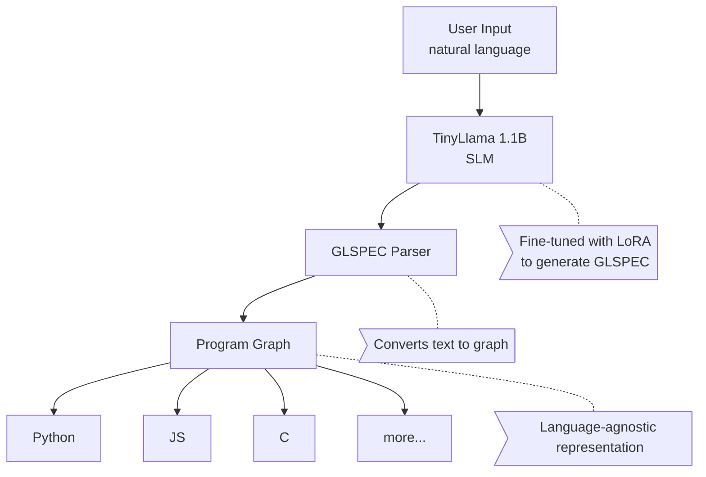

# Graph-Lang

A proof-of-concept exploring whether Small Language Models (SLMs) can generate useful code through a universal intermediate format.

## The Problem

Large Language Models (GPT-4, Claude, etc.) generate code directly, but they are expensive, slow, and require internet connectivity. Can a model 100x smaller achieve useful results by targeting a simpler intermediate representation?

## The Hypothesis

Instead of training a small model to generate Python, JavaScript, and C separately, we train it to generate a single intermediate format (GLSPEC). The translation from GLSPEC to real languages is deterministic and error-free.

```
Traditional approach:
  User -> GPT-4 (175B) -> Python
  User -> GPT-4 (175B) -> JavaScript
  User -> GPT-4 (175B) -> C
  (3 complex tasks, massive model)

Graph-Lang approach:
  User -> TinyLlama (1.1B) -> GLSPEC -> {Python, JS, C, ...}
  (1 simple task, small model, N outputs)
```

## Results

- TinyLlama 1.1B fine-tuned with LoRA generates valid GLSPEC with 100% accuracy on 52 test cases
- The same graph translates deterministically to Python, JavaScript, and C
- Inference cost is approximately 100x lower than large models
- No internet required after model download

## Architecture



## GLSPEC Format

GLSPEC is a minimal pseudo-code format with approximately 47 tokens. It is simple enough for a small model to generate reliably.

```
FUNC factorial(n: int) -> int:
  IF n <= 1:
    RETURN 1
  ELSE:
    RETURN n * factorial(n - 1)
  ENDIF
END

MAIN:
  PRINT factorial(6)
END
```

This generates identical logic in Python, JavaScript, and C.

## Installation

```bash
git clone https://github.com/dagasugsds/graph-lang.git
cd graph-lang
pip install -r requirements.txt
```

For fine-tuning (optional):

```bash
pip install transformers peft datasets torch
```

## Usage

### Using the parser directly

```python
from graph_lang import glspec_to_graph, PythonTranslator, JSTranslator, CTranslator

glspec = """
FUNC suma(a: int, b: int) -> int:
  RETURN a + b
END

MAIN:
  PRINT suma(3, 5)
END
"""

# Parse to graph
program = glspec_to_graph(glspec)

# Translate to different languages
print(PythonTranslator().translate(program))
print(JSTranslator().translate(program))
print(CTranslator().translate(program))
```

### Using the fine-tuned model

```bash
python run_program.py --input "create a function that adds two numbers"
```

### Running tests

```bash
python stress_test.py
```

### Fine-tuning your own model

```bash
# Generate dataset
python main.py  # Creates dataset_minillama.jsonl

# Train
python train_minillama_lora.py

# Test
python tester.py --model out_minillama_lora/final
```

## Project Structure

```
graph-lang/
  graph_lang/
    __init__.py
    core.py           # Graph nodes, operations, serializer
    glspec_parser.py  # GLSPEC tokenizer and parser
    translators.py    # Python, JS, C code generators
    dataset.py        # Dataset generation utilities
  main.py             # Demo script
  run_program.py      # End-to-end inference pipeline
  train_minillama_lora.py  # Fine-tuning script
  tester.py           # Automated test suite
  stress_test.py      # Edge case testing
```

## Supported Operations

| Category     | Operations                                |
| ------------ | ----------------------------------------- |
| Variables    | VAR, SET                                  |
| Arithmetic   | +, -, \*, /, %                            |
| Comparison   | ==, !=, <, >, <=, >=                      |
| Logic        | AND, OR, NOT                              |
| Control flow | IF/ELSE/ENDIF, WHILE/ENDWHILE, FOR/ENDFOR |
| Functions    | FUNC/END, RETURN, CALL                    |
| I/O          | PRINT                                     |
| Flow control | BREAK, CONTINUE                           |

## Limitations

This is an experimental proof-of-concept, not production software.

Current limitations:

- No arrays or lists
- No structs or classes
- No string manipulation
- No standard library
- Limited to algorithmic code (no I/O beyond PRINT)
- Dataset is small (52 examples)

## What This Is

- A proof of concept
- An exploration of SLMs for code generation
- A base for further research
- A demonstration that small models can be useful with the right architecture

## What This Is Not

- A replacement for Copilot or GPT-4
- A production-ready code generator
- An optimizing compiler
- A general-purpose programming language

## Future Work

- Add arrays and basic data structures
- Add structs (translating to classes in Python/JS, structs in C)
- Expand the training dataset
- Test with smaller models (500M, 125M)
- Add more target languages
- Web demo interface

## License

MIT License. See LICENSE file for details.
